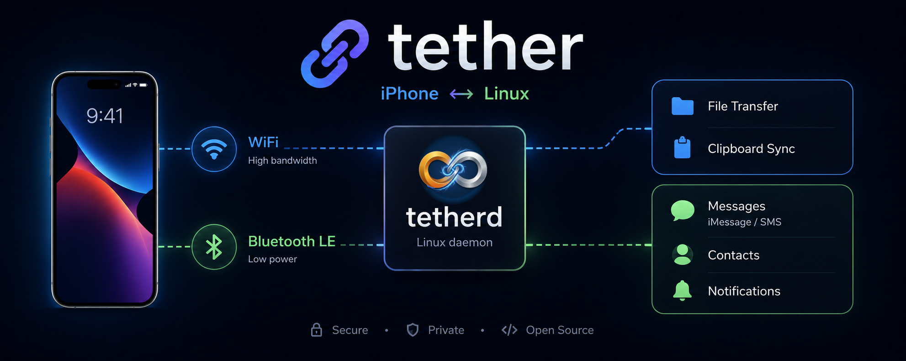
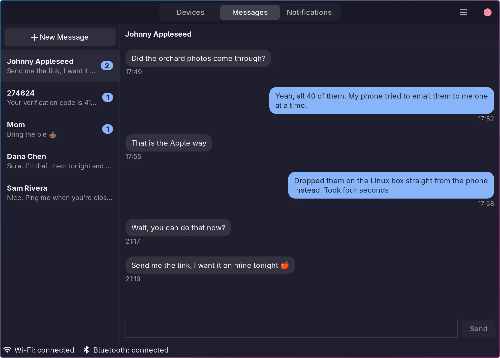

# Tether

> Bridge your iPhone to the Linux Wayland desktop

**Tether** aims to support all of the [Apple Continuity](https://www.apple.com/macos/continuity/) features on Linux that are technically possible. If you've migrated away from macOS but still carry an iPhone, Tether provides the missing ecosystem integration.

[](LICENSE)

[](https://addons.mozilla.org/en-US/firefox/addon/tether-browser-extension/)

[](https://addons.thunderbird.net/en-US/thunderbird/addon/tether-mail-extension/)

[](https://apps.apple.com/us/app/tether-linux-companion/id6762097135)

[](https://github.com/zackb/tether/actions/workflows/arch.yml)
[](https://github.com/zackb/tether/actions/workflows/fedora.yml)
[](https://github.com/zackb/tether/actions/workflows/debian.yml)
[](https://github.com/zackb/tether/actions/workflows/ubuntu.yml)



## Features

| Feature | Status |
|---------|--------|
| **Clipboard Sync** | ✅ Stable |
| **File Transfer** | ✅ Stable |
| **iOS App** | ✅ Stable |
| **Browser Extension** | ✅ Stable |
| **Mail Extension** | ✅ Stable |
| **Messages (SMS/iMessage)** | 🧪 Beta |
| **Notification Mirroring** | 🧪 Beta |
| **TOTP/OTP Vault** | 🗓️ Planning |

### Clipboard Sync
Text copied on your Linux desktop appears instantly on your iPhone, and vice versa.

### File Transfer
Drag and drop files from Linux directly into the iPhone app, or receive files automatically to your `$XDG_DOWNLOAD_DIR` (~/Downloads).

### Messages and Notifications
Read and reply to SMS and iMessage conversations, and see notifications from any app on the phone, on the Linux desktop.

### Device Pairing
There are two ways tether communicates with the iPhone:
- WiFi: for clipboard sync, file transfer, and OTP handling
- Bluetooth: for Messages and Notifications

You can use either or both, depending on your needs.

Connections use Mutually Authenticated TLS (mTLS), restricting TCP traffic securely using X.509 RSA certificates.

### OTP Handling
Streamline two-factor authentication across your devices:
- iOS Share Extension: Send OTP codes from your iPhone to your Linux clipboard.
- Thunderbird Addon: Automatically parse OTP codes from incoming email messages.
- Browser Extension: Autofill OTP codes into login forms from the iOS app or the mail extension.
- SMS / iMessage: Detects OTP codes in incoming messages and notifications and offers them to the browser extension for autofill.

### Browser & Mail Extensions
A unified WebExtension that works in Thunderbird/Betterbird and Firefox/Chromium browsers:

- **Thunderbird/Betterbird:** Detects OTP codes in incoming emails (verification codes, 2FA messages) and copies them to the clipboard or sends them to the Tether daemon for vault storage
- **Firefox/Chromium:** Autofills OTP codes into login forms by retrieving secrets from the Tether vault, with one-click verification for sites using TOTP-based 2FA

The extension communicates with `tetherd` via native messaging. This allows users to autofill OTP codes into websites when the email arrives. 

## Installation

### iOS App
- Get the app: [Tether - Linux Companion](https://apps.apple.com/us/app/tether-linux-companion/id6762097135)

### Browser Extension
- Firefox: [Tether Browser Extension](https://addons.mozilla.org/en-US/firefox/addon/tether-browser-extension/)

### Mail Extension
- Thunderbird: [Tether Mail Extension](https://addons.thunderbird.net/en-US/thunderbird/addon/tether-mail-extension/)

### Arch Linux

```bash
yay -S tether
```

### Build from Source

On Debian/Ubuntu:

```bash
sudo apt install build-essential cmake ninja-build pkg-config git \
    libwayland-dev libavahi-client-dev libssl-dev \
    libglib2.0-dev libgtk-3-dev libgtk-layer-shell-dev libnotify-dev \
    npm zip
```

On Fedora:

```bash
sudo dnf install gcc-c++ cmake ninja-build pkgconf-pkg-config git \
    wayland-devel avahi-devel openssl-devel \
    glib2-devel gtk3-devel gtk-layer-shell-devel libnotify-devel \
    npm zip
```

```bash
# Clone the repository
git clone https://github.com/zackb/tether.git
cd tether

# Build and test
make release

# Install the daemon, cli, and GTK app
make install
```

## Quick Start
1. On Linux, launch the GTK app (tether-gtk) or run the CLI to pair your iPhone.

2. WiFi pair via the GUI or CLI:

   Open the iOS app, it will auto-discover the daemon. You will be prompted on both the iPhone and Linux to accept the pairing request. Once accepted on both ends, the devices are paired.

   or

   ```bash
   tether pair
   ```

3. Bluetooth (for Messages and Notifications):

   First, one-time system setup. This prints only the steps your machine still
   needs, with the exact commands:

   ```bash
   tether --bt-setup
   ```

   Tether never applies these itself: they change how the machine behaves over
   Bluetooth outside of Tether, so running them is your call. The same steps
   appear in the GTK app's Devices page, with a "Copy commands" button.

   Then pair. In the GTK app, pick your iPhone under BLUETOOTH on the Devices
   page and press "Pair over Bluetooth". Confirm the code on both the iPhone and
   Linux.

   or

   ```bash
   tether --bt-devices          # find the iPhone's address
   tether --bt-pair <address>
   tether --bt-connection       # what is up, and what is not
   ```

4. On the iPhone, under Settings > Bluetooth > (i) for this computer, enable
   "Show Message Notifications" and "Sync Contacts". Both are needed. They can
   take a few minutes to appear; "Show iPhone Permissions" in the GTK app
   re-advertises so they show up again.


## Components

1. **`tetherd`**: A background process running on Linux manages Bluetooth, TCP+mTLS, and Wayland integration.

2. **`tether`**: A CLI to communicate with the daemon. This also allows the WebExtension to interface with the daemon via native messaging.

3. **`tether-gtk`**: An application for Linux that provides a graphical interface to manage devices, send files, trigger clipboard sync, read and reply to iPhone messages, see mirrored notifications, and monitor connection status.

4. **iPhone App**: Discovers the daemon via Bonjour/mDNS, utilizing Apple's `Network.framework` for secure TLS negotiation. Not required for SMS/iMessage and notification mirroring, which use Bluetooth.

5. **Browser/Mail Extension**: WebExtension that interfaces with the daemon via native messaging. Use with Thunderbird/Betterbird and Firefox or Chromium-based browsers.

## Requirements

### Linux
- Wayland compositor with `wlr-data-control` protocol (Hyprland, Sway, [Fenriz](https://github.com/zackb/fenriz) etc.)
- Build tools: cmake, ninja, pkg-config

### Dependencies
- `wayland-client`
- `openssl`
- `pkg-config`
- `ninja`
- `gtk3` (for `tether-gtk`)
- `nlohmann-json`
- `glib2`
- `avahi`
- `bluez`, `bluez-utils`, and `bluez-obex` (for messages and notifications)

#### Bluetooth (for Messages and Notifications)
- BlueZ 5.86+ must be running with experimental bearer API. Tether ships the
  systemd drop-in; `tether --bt-setup` prints the one command that applies it.
  Do this **before** pairing.
- A controller with BR/EDR, LE, and advertising support.
- Notification mirroring does not work on iOS 18 and earlier.

## Roadmap

- [x] Complete iOS app development
- [x] Add end-to-end encryption for file transfers
- [x] Release browser extension for Firefox
- [x] Release mail extension for Thunderbird
- [x] Read and reply to iPhone messages over Bluetooth
- [x] Bluetooth for messages and notifications
- [ ] Implement TOTP/OTP vault with Safari autofill
- [ ] Explore macOS support

## Acknowledgements
* [ancs4linux](https://github.com/pzmarzly/ancs4linux) for pioneering the ANCS notifications technique.
* [iphonebridge](https://github.com/gabrielmeir53/iphonebridge) for the research on MAP Messages.
* @orychalk for many many feature ideas, bug reports, beta testing.


Contributions are welcome!

## License

Tether is licensed under the [MIT License](LICENSE).
